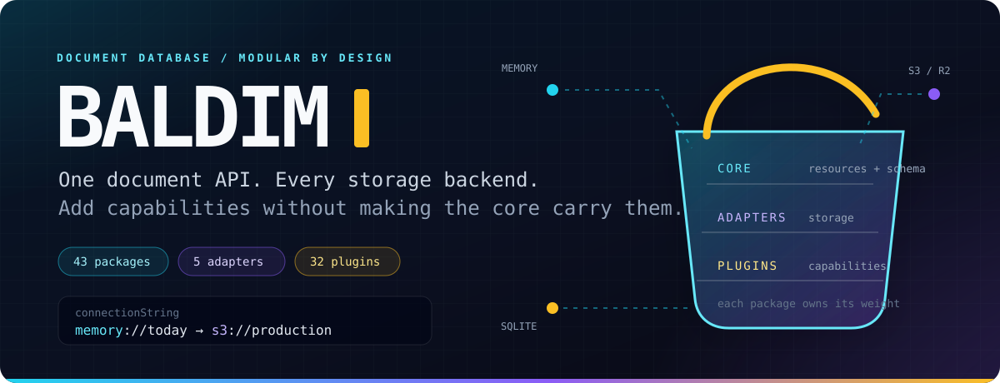
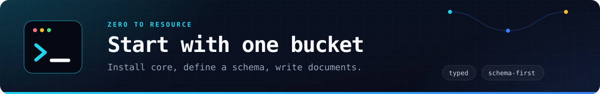
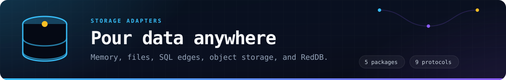
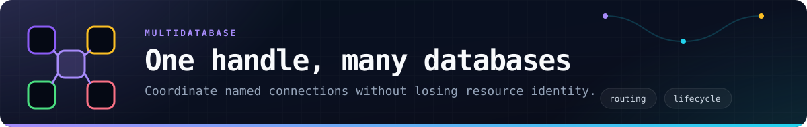
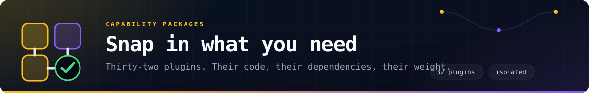
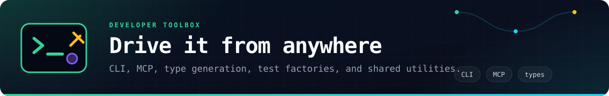
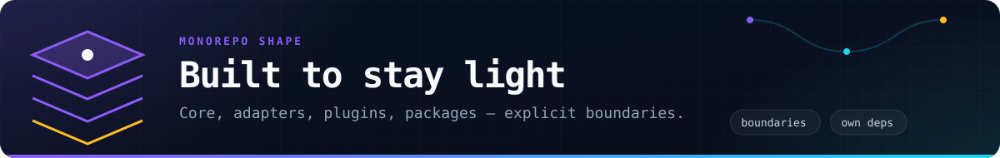
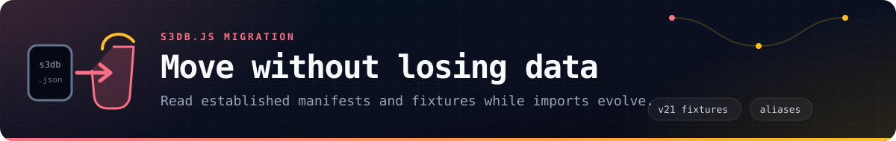
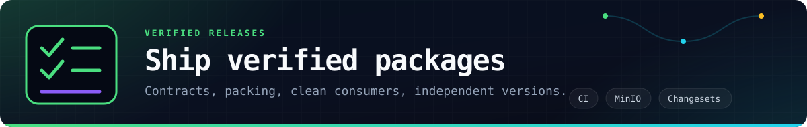

<p align="center">
  
</p>

<p align="center">
  <a href="https://github.com/forattini-dev/baldin/actions/workflows/ci.yml"></a>
  
  
  
  <a href="UNLICENSE"></a>
</p>

<p align="center">
  <strong>A TypeScript document database whose storage and capabilities are packages you choose.</strong><br>
  Start in memory, move to SQLite or S3, expose an API, add search, queues, identity, automation, and more without turning the core into a dependency warehouse.
</p>

---

Baldin gives every backend the same resource API: schemas, validation, CRUD, queries, partitions, streams, behaviors, hooks, and concurrency. Storage adapters translate that contract to the provider. Plugins add complete capabilities and own their runtime dependencies.

| What you get | What it means |
| --- | --- |
| **One resource model** | Application code keeps the same shape across memory, files, SQLite, libSQL, D1, S3-compatible storage, and RedDB. |
| **A deliberately narrow core** | Provider SDKs, web frameworks, browser runtimes, and queue clients stay in the packages that use them. |
| **Real multidatabase coordination** | `DatabaseManager` routes named connections and protects resource identity across databases. |
| **A migration path from s3db.js** | Existing manifests, storage defaults, environment variables, and compatibility aliases remain understood. |



## Quick start

```sh
pnpm add @baldin/core
```

The separate memory adapter is included by core, so the first database needs no provider setup.

```ts
import { Baldin } from '@baldin/core';

const database = new Baldin({
  connectionString: 'memory://my-app',
});

await database.connect();

const tasks = await database.createResource({
  name: 'tasks',
  attributes: {
    title: 'string|required|minlength:2',
    done: 'boolean|required',
  },
});

const task = await tasks.insert({
  id: 'ship-it',
  title: 'Launch Baldin',
  done: false,
});

await tasks.update(task.id, { done: true });
const completed = await tasks.query({ done: true });

await database.disconnect();
```

Resources also support direct reads, deletes, pagination, indexed partitions, schema evolution, streams, hooks, and custom behaviors. Start with the [core package guide](core/README.md) and follow the [public API map](docs/public-api-mapping.md) when moving an existing s3db.js application.

> Package versions are prepared in the repository. Publishing them to npm is the remaining registry release step.



## Choose storage at runtime

Import an adapter once, then select it with the connection string. Each adapter owns its provider client and configuration code.

| Adapter | Protocols | Designed for |
| --- | --- | --- |
| [`@baldin/adapter-memory`](adapters/memory) | `memory:` | Tests, prototypes, ephemeral workloads; loaded by core automatically. |
| [`@baldin/adapter-filesystem`](adapters/filesystem) | `file:` | Local and mounted filesystems with durable object layout. |
| [`@baldin/adapter-sqlite`](adapters/sqlite) | `sqlite:`, `sqlite+libsql:`, `sqlite+d1:` | Local SQLite, remote libSQL, and Cloudflare D1. |
| [`@baldin/adapter-s3`](adapters/s3) | `s3:`, `http:`, `https:` | AWS S3, Cloudflare R2, MinIO, and compatible object stores. |
| [`@baldin/adapter-reddb`](adapters/reddb) | `reddb:` | RedDB through its public HTTP storage contract. |

```sh
pnpm add @baldin/core @baldin/adapter-sqlite
```

```ts
import { Baldin } from '@baldin/core';
import '@baldin/adapter-sqlite';

const database = new Baldin({
  connectionString: 'sqlite:./data/app.sqlite',
});

await database.connect();
```

Changing the connection string changes storage; the resource code above remains the same. Adapter-specific credentials, endpoints, bindings, retries, and transport options stay with the adapter.



## Coordinate multiple databases

`DatabaseManager` connects named databases, forwards lifecycle events, routes work through a default connection, and provides unified resource lookup. Resource names created through the manager are unique across all of its connections.

```ts
import { DatabaseManager } from '@baldin/core';
import '@baldin/adapter-s3';

const databases = new DatabaseManager({
  default: 'primary',
  connections: {
    primary: { connectionString: 'memory://application' },
    analytics: { connectionString: 's3://analytics-data' },
  },
});

await databases.connect();

await databases.createResource({
  name: 'users',
  attributes: { name: 'string|required' },
});

await databases.createResource({
  connection: 'analytics',
  name: 'events',
  attributes: { type: 'string|required' },
});

const events = databases.resource('events');
const analytics = databases.connection('analytics');
```

Use the manager for cross-connection resource creation so duplicate names are rejected before metadata is written.



## Add only the capabilities you need

Every plugin is an independently publishable package with its own source, tests, manifest, and dependencies. Core exposes the plugin contract; plugins carry the cost of their own web frameworks, cloud SDKs, queues, browsers, ML runtimes, and provider clients.

### Indexing and data models

| Plugin | Capability |
| --- | --- |
| [`fulltext`](plugins/fulltext) | Persistent word indexes and ranked text search. |
| [`geo`](plugins/geo) | Geohash indexes, distance calculations, and spatial queries. |
| [`graph`](plugins/graph) | Indexed edges, traversal, and weighted shortest paths. |
| [`tree`](plugins/tree) | Adjacency-list and nested-set hierarchies. |
| [`vector`](plugins/vector) | Vector search, clustering, metrics, and optional `sqlite-vec` acceleration. |
| [`tfstate`](plugins/tfstate) | Terraform/OpenTofu state history, diffs, monitoring, and export. |
| [`tournament`](plugins/tournament) | Registration, formats, brackets, matches, and standings. |

### Operations and reliability

| Plugin | Capability |
| --- | --- |
| [`audit`](plugins/audit) | Persistent resource audit trails. |
| [`backup`](plugins/backup) | Full and incremental backups to filesystems or object storage. |
| [`cache`](plugins/cache) | Memory, filesystem, Redis, object-storage, partition-aware, and multi-tier caching. |
| [`costs`](plugins/costs) | Provider-aware usage accounting and cost projections. |
| [`eventual-consistency`](plugins/eventual-consistency) | Counters, consolidation, coordinated workers, and analytics. |
| [`metrics`](plugins/metrics) | Persistent telemetry and Prometheus export. |
| [`replicator`](plugins/replicator) | Database, queue, and webhook replication. |
| [`scheduler`](plugins/scheduler) | Distributed cron jobs, retries, locking, and execution history. |
| [`state-machine`](plugins/state-machine) | Workflows with guards, hooks, triggers, TTL, and transition history. |
| [`ttl`](plugins/ttl) | Indexed and lazy resource expiration. |

### Interfaces and messaging

| Plugin | Capability |
| --- | --- |
| [`api`](plugins/api) | Raffel-based HTTP/WebSocket API, auth, OpenAPI/USD docs, static files, and runtime inspection. |
| [`identity`](plugins/identity) | OAuth2/OIDC, sessions, onboarding, MFA, email, and administration. |
| [`websocket`](plugins/websocket) | Real-time CRUD, subscriptions, channels, tickets, and recovery. |
| [`smtp`](plugins/smtp) | SMTP relay/server modes, templates, retries, and delivery webhooks. |
| [`s3-queue`](plugins/s3-queue) | Durable database-backed queues with coordinated workers and retries. |
| [`queue-consumer`](plugins/queue-consumer) | Optional SQS, RabbitMQ, Redis, and BullMQ consumers. |

### Automation and inventory

| Plugin | Capability |
| --- | --- |
| [`cloud-inventory`](plugins/cloud-inventory) | Multi-cloud snapshots, diffs, schedules, and Terraform export. |
| [`cookie-farm`](plugins/cookie-farm) | Browser personas, warmup, rotation, reputation, and export. |
| [`cookie-farm-suite`](plugins/cookie-farm-suite) | Namespaced browser, persona, queue, and TTL workflows. |
| [`importer`](plugins/importer) | Streaming JSON, JSONL, CSV, TSV, and gzip imports. |
| [`kubernetes-inventory`](plugins/kubernetes-inventory) | Cluster discovery, snapshots, version history, and diffs. |
| [`ml`](plugins/ml) | TensorFlow.js regression, classification, time-series, and neural networks. |
| [`puppeteer`](plugins/puppeteer) | Browser automation, proxy pools, cookies, monitoring, and anti-bot inspection. |
| [`recon`](plugins/recon) | Passive, stealth, and active reconnaissance workflows. |
| [`spider`](plugins/spider) | Crawling, discovery, browser analysis, and pluggable queue/storage backends. |

```ts
import { Baldin } from '@baldin/core';
import { ApiPlugin } from '@baldin/plugin-api';

const database = new Baldin({ connectionString: 'memory://api' });
await database.connect();
await database.usePlugin(new ApiPlugin({ port: 3000 }));
```

The API, Identity, WebSocket, and SMTP plugins each depend on Raffel directly because they use it directly. Core and every storage adapter remain Raffel-free.



## Work from code, shell, or an agent

| Package | Purpose |
| --- | --- |
| [`@baldin/cli`](apps/cli) | The `baldin` command: configuration, resources, migrations, schemas, seeds, type generation, and an interactive console. |
| [`@baldin/mcp`](apps/mcp) | Stdio or Streamable HTTP MCP server with bundled documentation and database tools. |
| [`@baldin/typegen`](packages/typegen) | Generates typed resource maps for applications. |
| [`@baldin/testing`](packages/testing) | Factories and seeders for application and plugin tests. |
| [`@baldin/utils`](packages/utils) | Shared HTTP, error, memory, money, and encoding utilities with a defined public purpose. |

```sh
baldin --help
baldin configure
baldin resources list --connection memory://demo

# Run the MCP server over stdio
npx @baldin/mcp
```

Set `BALDIN_CONNECTION_STRING` to expose database tools through MCP. Documentation tools work without a database connection.



## Repository architecture

The package boundary comes first. Each public package owns its `src/`, tests, `package.json`, build output, runtime dependencies, and release version.

```text
baldin/
├── core/                 @baldin/core
├── adapters/
│   └── <adapter>/        @baldin/adapter-<adapter>
├── plugins/
│   └── <plugin>/         @baldin/plugin-<plugin>
├── packages/
│   └── <library>/        @baldin/<library>
└── apps/
    └── <application>/    executable products
```

```mermaid
flowchart LR
  apps[Apps: CLI · MCP] --> core[@baldin/core]
  apps --> adapters[Storage adapters]
  apps --> plugins[Capability plugins]
  apps --> packages[Shared packages]
  plugins --> core
  plugins --> packages
  adapters --> contracts[Core adapter contract]
  packages --> contracts
  core --> memory[@baldin/adapter-memory]
```

Core owns the engine, resource model, generic storage contracts, adapter registry, multidatabase manager, and plugin SDK. Adapters own storage implementations. Plugins own optional capabilities. Shared packages exist when multiple consumers need a stable public abstraction; they are not a dumping ground.

Read the complete [repository structure and dependency rules](docs/repository-structure.md).



## Migrate from s3db.js without rewriting data

Baldin grew from the s3db.js engine and preserves the storage contract while the package surface becomes modular.

- Existing buckets keep the `s3db.json` manifest and `s3dbVersion` metadata.
- Existing `S3DB_*` environment variables remain fallbacks; new configuration uses `BALDIN_*`.
- Storage defaults remain stable, so changing an import cannot silently select another bucket, directory, or database file.
- `S3db` and `BuckieDB` remain deprecated class aliases while applications move to `Baldin`.
- Read-only fixtures generated by s3db.js 21.6.2 cover manifests, schemas, documents, indexes, and partitions on filesystem, SQLite, and S3-compatible storage.

```ts
// Before
import S3db from 's3db.js';

// During migration — persisted data stays in place
import { Baldin } from '@baldin/core';
```

The [migration ledger](docs/migration.md), [parity audit](docs/parity-audit.md), and [compatibility boundaries](docs/compatibility-boundaries.md) record what is covered and what still requires provider credentials.



## Develop and release with confidence

Requires Node.js 24 or newer and pnpm 10.33.0.

```sh
pnpm install --frozen-lockfile
pnpm check:deps
pnpm typecheck
pnpm build
pnpm test
```

The CI pipeline enforces package dependency boundaries, type-checks and builds the workspace, runs all tests, exercises the S3 contract against MinIO, packs all 43 public packages, installs them into a clean consumer, and verifies their public entrypoints.

Changesets versions packages independently: a release changes only the packages affected by a change and the dependents whose declared ranges must move. The manual Release workflow creates the version PR or publishes those changed packages and their GitHub releases. Credentialed AWS S3, R2, RedDB, libSQL, and D1 contracts live in a separate manual provider workflow.

## License

[The Unlicense](UNLICENSE), preserving the license of the original s3db.js source.

<p align="center">
  <strong>Bring a bucket. Keep the API. Add only what the application deserves.</strong>
</p>
