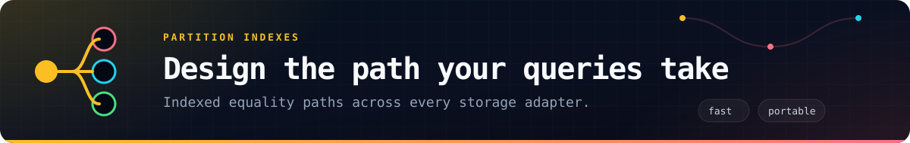
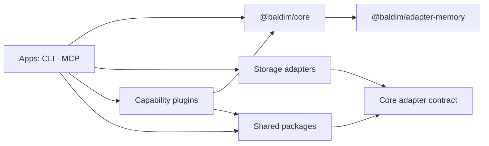

<p align="center">
  
</p>

<p align="center">
  <a href="https://github.com/forattini-dev/baldim/actions/workflows/ci.yml"></a>
  
  
  
  <a href="LICENSE"></a>
</p>

<p align="center">
  <strong>A TypeScript document database whose storage and capabilities are packages you choose.</strong><br>
  Start in memory, move to SQLite or S3, expose an API, add search, queues, identity, automation, and more without turning the core into a dependency warehouse.
</p>

---

Baldim gives every backend the same resource API: schemas, validation, CRUD, queries, partitions, streams, behaviors, hooks, and concurrency. Storage adapters translate that contract to the provider. Plugins add complete capabilities and own their runtime dependencies.

| What you get | What it means |
| --- | --- |
| **One resource model** | Application code keeps the same shape across memory, files, SQLite, libSQL, D1, S3-compatible storage, and RedDB. |
| **A deliberately narrow core** | Provider SDKs, web frameworks, browser runtimes, and queue clients stay in the packages that use them. |
| **Real multidatabase coordination** | `DatabaseManager` routes named connections and protects resource identity across databases. |
| **A migration path from s3db.js** | Existing manifests, storage defaults, environment variables, and compatibility aliases remain understood. |

## Documentation map

- [Quick start](#quick-start)
- [Resources and schemas](#work-with-resources)
  - [Create a resource](#define-a-resource-and-its-schema)
  - [CRUD](#write-read-update-and-delete)
  - [Bulk operations](#work-in-batches)
  - [Queries and lists](#query-and-list-documents)
  - [Pagination](#paginate-large-resources)
  - [Binary content](#attach-binary-content)
  - [Hooks](#transform-data-with-hooks)
- [Partitions](#index-access-paths-with-partitions)
- [Storage adapters](#choose-storage-at-runtime)
- [Multiple databases](#coordinate-multiple-databases)
- [Plugins](#add-only-the-capabilities-you-need)
- [CLI, MCP, and packages](#work-from-code-shell-or-an-agent)
- [Repository architecture](#repository-architecture)
- [Migration from s3db.js](#migrate-from-s3dbjs-without-rewriting-data)
- [Development and releases](#develop-and-release-with-confidence)


## Quick start

```sh
pnpm add @baldim/core
```

The separate memory adapter is included by core, so the first database needs no provider setup.

```ts
import { Baldim } from '@baldim/core';

const database = new Baldim({
  connectionString: 'memory://my-app',
});

await database.connect();

const tasks = await database.createResource({
  name: 'tasks',
  attributes: {
    title: 'string|required|minlength:2',
    done: 'boolean|required',
  },
});

const task = await tasks.insert({
  id: 'ship-it',
  title: 'Launch Baldim',
  done: false,
});

await tasks.update(task.id, { done: true });
const completed = await tasks.query({ done: true });

await database.disconnect();
```

The connection string identifies the storage protocol and database location. `memory://my-app` survives reconnects inside the same process and is ideal for tests and examples. Applications should connect once during startup and disconnect during graceful shutdown.

> Package versions are prepared in the repository. Publishing them to npm is the remaining registry release step.


## Work with resources

A `Database` owns named resources. A resource combines a persisted schema, an ID strategy, optional indexes, hooks, storage behavior, and the methods used to work with its documents.

### Define a resource and its schema

Call `createResource()` during application startup. The call creates a new definition or applies the current definition to a resource restored from storage, so it is safe to keep schema declarations in code.

```ts
const users = await database.createResource({
  name: 'users',
  timestamps: true,
  attributes: {
    email: 'email|required',
    name: 'string|required|minlength:2|maxlength:120',
    age: 'number|optional|min:0',
    active: 'boolean|required|default:true',
    roles: { type: 'array', items: 'string', optional: true },
    profile: {
      type: 'object',
      optional: true,
      properties: {
        locale: 'string|optional',
        timezone: 'string|optional',
      },
    },
  },
});
```

Schema strings use the `type|rule:value` form. Object definitions are useful for arrays, nested objects, defaults, and programmatic schemas. Common types include `string`, `number`, `boolean`, `date`, `email`, `array`, and `object`. Invalid writes reject before reaching storage.

After `connect()`, persisted resources are also available by name:

```ts
const users = database.resources.users;
const sameUsers = await database.getResource('users');

const definitions = await database.listResources();
const exists = database.resourceExists('users');
```

Useful resource options:

| Option | Purpose |
| --- | --- |
| `attributes` | Declares the validated document schema. |
| `timestamps` | Adds and maintains creation/update timestamps. |
| `partitions` | Declares indexed equality access paths. |
| `idGenerator` / `idSize` | Selects or customizes generated IDs. |
| `behavior` | Chooses how attributes are divided between metadata and body storage. |
| `hooks` / `middlewares` | Transforms or intercepts resource operations. |
| `cache` | Enables a configured cache for the resource. |
| `security` | Overrides password and secret-field settings. |
| `compression` | Overrides compression behavior. |
| `strictValidation` | Overrides database-level validation for this resource. |

Available storage behaviors are `user-managed`, `enforce-limits`, `truncate-data`, `body-overflow`, and `body-only`. The default `user-managed` behavior follows the schema mapping. `body-only` is useful for typed nested data that should live entirely in the object body.

### Write, read, update, and delete

```ts
const ada = await users.insert({
  id: 'user_ada',       // optional when the resource generates IDs
  email: 'ada@example.com',
  name: 'Ada Lovelace',
  active: true,
});

const userId = ada.id!;
const byId = await users.get(userId);
const maybeUser = await users.getOrNull('missing'); // null
const userExists = await users.exists(userId);

// Merges the supplied fields with the stored document.
await users.update(userId, { active: false });

// Partial update. Nested paths are accepted.
await users.patch(userId, { 'profile.locale': 'pt-BR' });

// Replaces the complete user payload while keeping the same ID.
await users.replace(userId, {
  email: 'ada@example.com',
  name: 'Ada Lovelace',
  active: true,
});

// Inserts when absent; updates when the ID already exists.
await users.upsert({
  id: 'user_grace',
  email: 'grace@example.com',
  name: 'Grace Hopper',
  active: true,
});

await users.delete(userId);
```

| Operation | Result |
| --- | --- |
| `insert(data)` | Creates one document and rejects a duplicate ID. |
| `get(id)` | Returns one document or throws when it cannot be read. |
| `getOrNull(id)` | Returns one document or `null` when it does not exist. |
| `exists(id)` | Checks existence without hydrating the document. |
| `update(id, fields)` | Deep-merges fields into an existing document. |
| `patch(id, fields)` | Applies a partial update and supports dotted nested paths. |
| `replace(id, data)` | Validates and writes a complete replacement. |
| `upsert({ id, ...data })` | Inserts or updates using a required ID. |
| `delete(id)` | Deletes the document and its partition references. |

Returned documents include their `id` and storage metadata such as `_etag`, `_lastModified`, `_hasContent`, and `_mimeType` when the selected adapter provides it.

### Work in batches

```ts
const inserted = await users.insertMany([
  { id: 'user_1', email: 'one@example.com', name: 'One', active: true },
  { id: 'user_2', email: 'two@example.com', name: 'Two', active: true },
]);

const selected = await users.getMany(['user_1', 'user_2']);
const result = await users.deleteMany(['user_1', 'user_2']);

console.log(result.deleted, result.errors);
```

`getAll()` and `deleteAll()` are available when the complete resource is intentionally needed. Prefer bounded lists, queries, or pages for growing datasets.

### Query and list documents

`query()` performs equality matching. When the filter covers a partition, Baldim automatically chooses the best matching partition and only scans that path. Any remaining fields are applied as residual equality filters.

```ts
const activeUsers = await users.query(
  { active: true, 'profile.locale': 'pt-BR' },
  { limit: 50, offset: 0 },
);

const firstUsers = await users.list({ limit: 50, offset: 0 });
const ids = await users.listIds({ limit: 50 });
const total = await users.count();
```

`list()` returns hydrated documents. `listIds()` returns only IDs and avoids reading document bodies. `count()` counts the selected resource or partition.

### Paginate large resources

Cursor pagination is the default and avoids large offsets:

```ts
const firstPage = await users.page({ size: 25 });

if (firstPage.nextCursor) {
  const secondPage = await users.page({
    size: 25,
    cursor: firstPage.nextCursor,
  });
}
```

Page-number navigation is also available. Do not combine `page` and `cursor` in the same call.

```ts
const page = await users.page({ page: 3, size: 25 });

console.log(page.items);
console.log(page.hasMore, page.nextCursor);
```

The result contains `items`, `pageSize`, `hasMore`, and `nextCursor`. `page` is populated for page-number requests; totals remain `null` because pagination does not run an implicit count.

### Attach binary content

Attributes and binary content can live on the same document and be managed independently.

```ts
const assets = await database.createResource({
  name: 'assets',
  attributes: { filename: 'string|required' },
});

await assets.insert({ id: 'logo', filename: 'logo.svg' });
await assets.setContent({
  id: 'logo',
  buffer: Buffer.from('<svg><!-- ... --></svg>'),
  contentType: 'image/svg+xml',
});

const { buffer, contentType } = await assets.content('logo');
const hasContent = await assets.hasContent('logo');
await assets.deleteContent('logo');
```

### Transform data with hooks

Hooks run around resource operations and may transform the value passed to the next stage.

```ts
const articles = await database.createResource({
  name: 'articles',
  attributes: {
    title: 'string|required',
    slug: 'string|required',
  },
  hooks: {
    beforeInsert: [async (data) => {
      const article = data as Record<string, unknown>;
      return {
        ...article,
        slug: String(article.title).toLowerCase().replaceAll(' ', '-'),
      };
    }],
  },
});

const removeHook = (data: unknown) => data;
articles.addHook('afterGet', removeHook);
articles.removeHook('afterGet', removeHook);
```

Supported hook pairs cover insert, update, patch, replace, delete, get, list, query, exists, count, `getMany`, and `deleteMany`. Plugins use the same lifecycle through the public plugin SDK.



## Index access paths with partitions

Partitions are secondary access paths stored through the selected adapter. They make common equality lookups direct and portable across memory, filesystem, SQLite, S3, and RedDB.

Use the shorthand when each field needs its own partition:

```ts
const orders = await database.createResource({
  name: 'orders',
  attributes: {
    tenantId: 'string|required',
    status: 'string|required',
    createdAt: 'string|required',
    total: 'number|required|min:0',
  },
  partitions: ['tenantId', 'status'], // creates byTenantId and byStatus
});
```

Use named definitions for compound access paths:

```ts
const orders = await database.createResource({
  name: 'orders',
  attributes: {
    tenantId: 'string|required',
    status: 'string|required',
    createdAt: 'string|required',
    total: 'number|required|min:0',
  },
  partitions: {
    byTenant: {
      fields: { tenantId: 'string' },
    },
    byTenantAndStatus: {
      fields: {
        tenantId: 'string',
        status: 'string',
      },
    },
    byDay: {
      // The partition rule normalizes ISO timestamps to YYYY-MM-DD.
      fields: { createdAt: 'date' },
    },
  },
});
```

Query through a partition explicitly:

```ts
const pending = await orders.list({
  partition: 'byTenantAndStatus',
  partitionValues: {
    tenantId: 'acme',
    status: 'pending',
  },
  limit: 100,
});

const pendingIds = await orders.listIds({
  partition: 'byTenantAndStatus',
  partitionValues: { tenantId: 'acme', status: 'pending' },
});

const pendingCount = await orders.count({
  partition: 'byTenantAndStatus',
  partitionValues: { tenantId: 'acme', status: 'pending' },
});
```

Or let the query planner select it from an equality filter:

```ts
const pending = await orders.query({
  tenantId: 'acme',
  status: 'pending',
});
```

Baldim creates partition references on insert, moves them when indexed fields change, and removes them on delete. Every field used by a partition must exist in `attributes`. Use `asyncPartitions: false` when the write must wait for portable partition-reference maintenance; adapters with native transactional indexes can provide stronger behavior directly.


## Choose storage at runtime

Install the adapter next to your application, import it once in the process entrypoint, then select it with the connection string. Loading the module registers its protocols in core. You do not repeat the import for every database or module. Executable bundles such as the CLI and MCP server load the official adapters for you.

| Adapter | Protocols | Designed for |
| --- | --- | --- |
| [`@baldim/adapter-memory`](adapters/memory) | `memory:` | Tests, prototypes, ephemeral workloads; loaded by core automatically. |
| [`@baldim/adapter-filesystem`](adapters/filesystem) | `file:` | Local and mounted filesystems with durable object layout. |
| [`@baldim/adapter-sqlite`](adapters/sqlite) | `sqlite:`, `sqlite+libsql:`, `sqlite+d1:` | Local SQLite, remote libSQL, and Cloudflare D1. |
| [`@baldim/adapter-s3`](adapters/s3) | `s3:`, `http:`, `https:` | AWS S3, Cloudflare R2, MinIO, and compatible object stores. |
| [`@baldim/adapter-reddb`](adapters/reddb) | `reddb:` | RedDB through its public HTTP storage contract. |

```sh
pnpm add @baldim/core @baldim/adapter-sqlite
```

```ts
import { Baldim } from '@baldim/core';
import '@baldim/adapter-sqlite'; // registers sqlite:, sqlite+libsql:, sqlite+d1:

const database = new Baldim({
  connectionString: 'sqlite:./data/app.sqlite',
});

await database.connect();
```

The connection string selects the adapter while `clientOptions` carries provider configuration:

```ts
import { Baldim } from '@baldim/core';
import '@baldim/adapter-s3';

const database = new Baldim({
  connectionString: 's3://application-data/prefix',
  clientOptions: {
    region: 'us-east-1',
    endpoint: process.env.S3_ENDPOINT,
    forcePathStyle: true,
  },
});
```

You can bypass protocol registration by constructing a client explicitly:

```ts
import { Baldim } from '@baldim/core';
import { S3Client } from '@baldim/adapter-s3';

const client = new S3Client({
  connectionString: 's3://application-data/prefix',
});

const database = new Baldim({ client });
```

Changing storage does not change resource code. Adapter-specific credentials, endpoints, bindings, retries, and transport options stay with the adapter package that uses them.

### Common database options

```ts
const database = new Baldim({
  connectionString: process.env.BALDIM_CONNECTION_STRING!,
  logLevel: 'info',
  parallelism: 20,
  strictValidation: true,
  deferMetadataWrites: true,
  metadataWriteDelay: 100,
  versioningEnabled: false,
  exitOnSignal: true,
});
```

| Option | Purpose |
| --- | --- |
| `connectionString` | Selects the registered storage protocol and location. |
| `client` | Uses an already constructed storage client. |
| `clientOptions` | Passes provider-specific settings to the selected adapter. |
| `parallelism` | Controls concurrent storage work. |
| `strictValidation` | Rejects documents that violate the resource schema. |
| `deferMetadataWrites` | Coalesces resource-definition writes. Call `flushMetadata()` before a controlled shutdown when needed. |
| `logLevel` / `logger` | Configures built-in logging or supplies an application logger. |
| `exitOnSignal` | Enables lifecycle cleanup for process signals. |


## Coordinate multiple databases

`DatabaseManager` connects named databases, forwards lifecycle events, routes work through a default connection, and provides unified resource lookup. Resource names created through the manager are unique across all of its connections.

```ts
import { DatabaseManager } from '@baldim/core';
import '@baldim/adapter-s3'; // registers s3:, http:, https:

const databases = new DatabaseManager({
  default: 'primary',
  defaults: {
    logLevel: 'info',
    strictValidation: true,
    exitOnSignal: true,
  },
  connections: {
    primary: { connectionString: 'memory://application' },
    analytics: {
      connectionString: 's3://analytics-data',
      clientOptions: { region: 'us-east-1' },
    },
  },
});

await databases.connect();

await databases.createResource({
  connection: 'primary', // optional: `primary` is the configured default
  name: 'users',
  attributes: { name: 'string|required' },
});

await databases.createResource({
  connection: 'analytics',
  name: 'events',
  attributes: { type: 'string|required' },
});

const users = databases.resources.users; // unified map across every connection
const events = databases.resource('events'); // unified lookup by globally unique name
const analytics = databases.connection('analytics');
const analyticsEvents = analytics.resources.events; // connection-local lookup

console.log(databases.connectionNames); // ['primary', 'analytics']
console.log(databases.getConnectionForResource('events')); // 'analytics'

await databases.disconnect();
```

`defaults` are merged into every connection; values inside a named connection win. The `connection` field passed to `createResource()` is optional: omitting it routes the resource to the configured default database. Because resource names are globally unique inside a manager, `resource(name)` and `resources` can provide a unified view without asking for a connection. Use `connection(name).resource(...)` or `connection(name).resources` when you want to work explicitly inside one database.

| Manager API | Purpose |
| --- | --- |
| `connect()` / `disconnect()` | Starts or stops every named database in parallel. Partial connection failures are rolled back. |
| `connection(name)` | Returns one database for direct database-level work. |
| `defaultConnection` | Returns the configured default database. |
| `createResource(config)` | Creates a resource on `config.connection` or on the default. |
| `resource(name)` | Finds a resource across all managed databases. |
| `resources` | Returns the unified resource map. |
| `connectionNames` | Lists configured connection names. |
| `getConnectionForResource(name)` | Reports which connection owns a resource. |

Resource names are globally unique inside one manager. Use `manager.createResource()` for cross-connection creation so duplicates are rejected before metadata is written. Events from child databases are forwarded with the connection name as a prefix, such as `primary:db:connected`.


## Add only the capabilities you need

Every plugin is an independently publishable package with its own source, tests, manifest, and dependencies. Core exposes the plugin contract; plugins carry the cost of their own web frameworks, cloud SDKs, queues, browsers, ML runtimes, and provider clients.

Install only the plugin packages used by the application:

```sh
pnpm add @baldim/core @baldim/plugin-fulltext @baldim/plugin-ttl
```

Attach a plugin with `database.usePlugin()`. Installation, startup, hooks, resource extensions, and cleanup then follow the database lifecycle.

```ts
import { Baldim } from '@baldim/core';
import { FullTextPlugin } from '@baldim/plugin-fulltext';

const database = new Baldim({ connectionString: 'memory://catalog' });
await database.connect();

const products = await database.createResource({
  name: 'products',
  attributes: {
    name: 'string|required',
    description: 'string|optional',
  },
});

const fulltext = new FullTextPlugin({
  fields: { products: ['name', 'description'] },
});
await database.usePlugin(fulltext);

await products.insert({
  id: 'blue-bucket',
  name: 'Blue bucket',
  description: 'Small, durable, and fast',
});

const matches = await fulltext.searchRecords(
  'products',
  'durable',
);
```

Pass a second argument to give an instance its own registry name, which is useful when running the same plugin more than once:

```ts
const analyticsSearch = new FullTextPlugin({
  fields: { products: ['name'] },
});
await database.usePlugin(analyticsSearch, 'analytics-search');
const installed = database.plugins['analytics-search'];

await database.uninstallPlugin('analytics-search', { purgeData: false });
```

Plugins may create their own namespaced resources, add hooks or middleware, and extend a resource with capability-specific APIs such as `resource.tree` or `resource.graph`. Each plugin README documents its constructor options and the API it adds.

### Indexing and data models

| Plugin | Capability |
| --- | --- |
| [`fulltext`](plugins/fulltext) | Persistent word indexes and ranked text search. |
| [`geo`](plugins/geo) | Geohash indexes, distance calculations, and spatial queries. |
| [`graph`](plugins/graph) | Indexed edges, traversal, and weighted shortest paths. |
| [`tree`](plugins/tree) | Adjacency-list and nested-set hierarchies. |
| [`vector`](plugins/vector) | Vector search, clustering, metrics, and optional `sqlite-vec` acceleration. |
| [`tfstate`](plugins/tfstate) | Terraform/OpenTofu state history, diffs, monitoring, and export. |
| [`tournament`](plugins/tournament) | Registration, formats, brackets, matches, and standings. |

### Operations and reliability

| Plugin | Capability |
| --- | --- |
| [`audit`](plugins/audit) | Persistent resource audit trails. |
| [`backup`](plugins/backup) | Full and incremental backups to filesystems or object storage. |
| [`cache`](plugins/cache) | Memory, filesystem, Redis, object-storage, partition-aware, and multi-tier caching. |
| [`costs`](plugins/costs) | Provider-aware usage accounting and cost projections. |
| [`eventual-consistency`](plugins/eventual-consistency) | Counters, consolidation, coordinated workers, and analytics. |
| [`metrics`](plugins/metrics) | Persistent telemetry and Prometheus export. |
| [`replicator`](plugins/replicator) | Database, queue, and webhook replication. |
| [`scheduler`](plugins/scheduler) | Distributed cron jobs, retries, locking, and execution history. |
| [`state-machine`](plugins/state-machine) | Workflows with guards, hooks, triggers, TTL, and transition history. |
| [`ttl`](plugins/ttl) | Indexed and lazy resource expiration. |

### Interfaces and messaging

| Plugin | Capability |
| --- | --- |
| [`api`](plugins/api) | Raffel-based HTTP/WebSocket API, auth, OpenAPI/USD docs, static files, and runtime inspection. |
| [`identity`](plugins/identity) | OAuth2/OIDC, sessions, onboarding, MFA, email, and administration. |
| [`websocket`](plugins/websocket) | Real-time CRUD, subscriptions, channels, tickets, and recovery. |
| [`smtp`](plugins/smtp) | SMTP relay/server modes, templates, retries, and delivery webhooks. |
| [`s3-queue`](plugins/s3-queue) | Durable database-backed queues with coordinated workers and retries. |
| [`queue-consumer`](plugins/queue-consumer) | Optional SQS, RabbitMQ, Redis, and BullMQ consumers. |

### Automation and inventory

| Plugin | Capability |
| --- | --- |
| [`cloud-inventory`](plugins/cloud-inventory) | Multi-cloud snapshots, diffs, schedules, and Terraform export. |
| [`cookie-farm`](plugins/cookie-farm) | Browser personas, warmup, rotation, reputation, and export. |
| [`cookie-farm-suite`](plugins/cookie-farm-suite) | Namespaced browser, persona, queue, and TTL workflows. |
| [`importer`](plugins/importer) | Streaming JSON, JSONL, CSV, TSV, and gzip imports. |
| [`kubernetes-inventory`](plugins/kubernetes-inventory) | Cluster discovery, snapshots, version history, and diffs. |
| [`ml`](plugins/ml) | TensorFlow.js regression, classification, time-series, and neural networks. |
| [`puppeteer`](plugins/puppeteer) | Browser automation, proxy pools, cookies, monitoring, and anti-bot inspection. |
| [`recon`](plugins/recon) | Passive, stealth, and active reconnaissance workflows. |
| [`spider`](plugins/spider) | Crawling, discovery, browser analysis, and pluggable queue/storage backends. |

For example, expose resources through the Raffel-based API plugin:

```ts
import { ApiPlugin } from '@baldim/plugin-api';

await database.usePlugin(new ApiPlugin({ port: 3000 }));
```

Or add indexed and lazy expiration policies:

```ts
import { TTLPlugin } from '@baldim/plugin-ttl';

await database.createResource({
  name: 'sessions',
  attributes: { token: 'string|required' },
});

await database.usePlugin(new TTLPlugin({
  resources: {
    sessions: { ttl: 3600, onExpire: 'hard-delete' },
  },
}));
```

The API, Identity, WebSocket, and SMTP plugins each depend on Raffel directly because they use it directly. Core and every storage adapter remain Raffel-free.


## Work from code, shell, or an agent

| Package | Purpose |
| --- | --- |
| [`@baldim/cli`](apps/cli) | The `baldim` command: configuration, resources, migrations, schemas, seeds, type generation, and an interactive console. |
| [`@baldim/mcp`](apps/mcp) | Stdio or Streamable HTTP MCP server with bundled documentation and database tools. |
| [`@baldim/typegen`](packages/typegen) | Generates typed resource maps for applications. |
| [`@baldim/testing`](packages/testing) | Factories and seeders for application and plugin tests. |
| [`@baldim/utils`](packages/utils) | Shared HTTP, error, memory, money, and encoding utilities with a defined public purpose. |

```sh
baldim --help
baldim configure
baldim resources list --connection memory://demo

# Run the MCP server over stdio
npx @baldim/mcp
```

Set `BALDIM_CONNECTION_STRING` to expose database tools through MCP. Documentation tools work without a database connection.


## Repository architecture

The package boundary comes first. Each public package owns its `src/`, tests, `package.json`, build output, runtime dependencies, and release version.

```text
baldim/
├── core/                 @baldim/core
├── adapters/
│   └── <adapter>/        @baldim/adapter-<adapter>
├── plugins/
│   └── <plugin>/         @baldim/plugin-<plugin>
├── packages/
│   └── <library>/        @baldim/<library>
└── apps/
    └── <application>/    executable products
```



Core owns the engine, resource model, generic storage contracts, adapter registry, multidatabase manager, and plugin SDK. Adapters own storage implementations. Plugins own optional capabilities. Shared packages exist when multiple consumers need a stable public abstraction; they are not a dumping ground.

Read the complete [repository structure and dependency rules](docs/repository-structure.md).


## Migrate from s3db.js without rewriting data

Baldim grew from the s3db.js engine and preserves the storage contract while the package surface becomes modular.

- Existing buckets keep the `s3db.json` manifest and `s3dbVersion` metadata.
- Existing `S3DB_*` environment variables remain fallbacks; new configuration uses `BALDIM_*`.
- Storage defaults remain stable, so changing an import cannot silently select another bucket, directory, or database file.
- `S3db` and `BuckieDB` remain deprecated class aliases while applications move to `Baldim`.
- Read-only fixtures generated by s3db.js 21.6.2 cover manifests, schemas, documents, indexes, and partitions on filesystem, SQLite, and S3-compatible storage.

```ts
// Before
import S3db from 's3db.js';

// During migration — persisted data stays in place
import { Baldim } from '@baldim/core';
```

The [migration ledger](docs/migration.md), [parity audit](docs/parity-audit.md), and [compatibility boundaries](docs/compatibility-boundaries.md) record what is covered and what still requires provider credentials.


## Develop and release with confidence

Requires Node.js 24 or newer and pnpm 10.33.0.

```sh
pnpm install --frozen-lockfile
pnpm check:deps
pnpm typecheck
pnpm build
pnpm test
```

The CI pipeline enforces package dependency boundaries, type-checks and builds the workspace, runs all tests, exercises the S3 contract against MinIO, packs all 43 public packages, installs them into a clean consumer, and verifies their public entrypoints.

Changesets versions packages independently: a release changes only the packages affected by a change and the dependents whose declared ranges must move. The manual Release workflow creates the version PR or publishes those changed packages and their GitHub releases. Credentialed AWS S3, R2, RedDB, libSQL, and D1 contracts live in a separate manual provider workflow.

## License

[MIT](LICENSE).

<p align="center">
  <strong>Bring a bucket. Keep the API. Add only what the application deserves.</strong>
</p>
